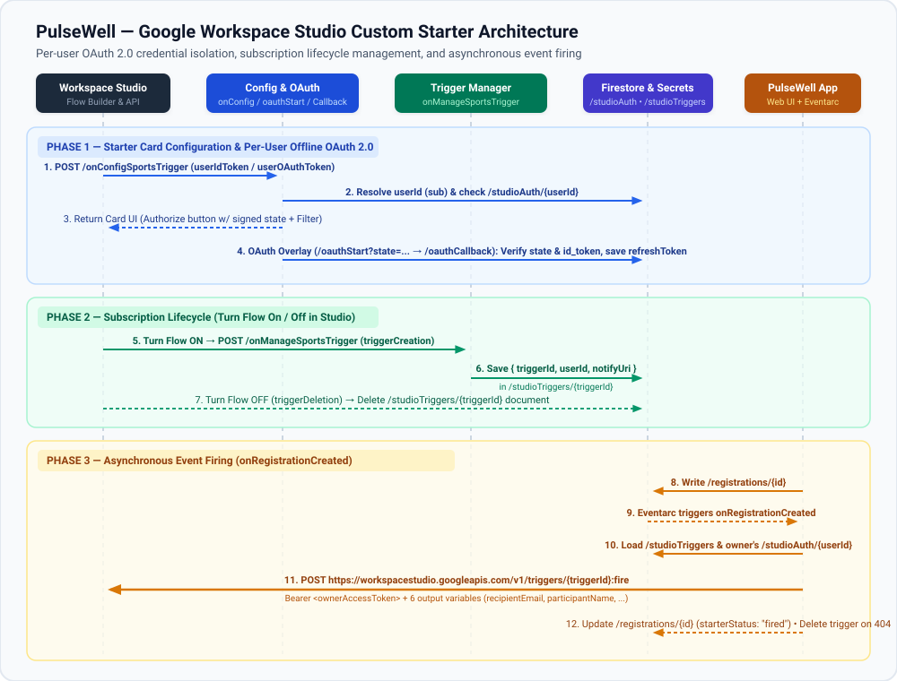
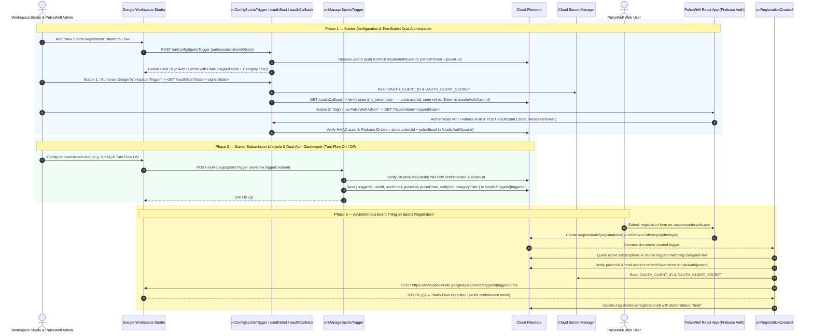

# PulseWell — Google Workspace Studio Custom Starter Blueprint

## 1. Overview

**PulseWell** is an end-to-end reference application demonstrating how to build, authorize, and fire a **Google Workspace Studio Custom Starter** (`workflowTrigger`) using an **HTTP Alternate Runtime** backed by **Firebase Hosting**, **Firebase Authentication**, **Cloud Firestore**, **Cloud Functions for Firebase (2nd Gen)**, and **Google Cloud Secret Manager**.

When an employee signs up for a campus health or sports session in the PulseWell web app:
1. The registration is written to the `registrations` collection in Cloud Firestore.
2. A Firestore-triggered Cloud Function (`onRegistrationCreated`) detects the new registration directly via Eventarc.
3. For each matching active starter subscription in `/studioTriggers/{triggerId}`, `onRegistrationCreated` verifies that the trigger owner has a linked PulseWell Admin account (`pulseUid`) and exchanges their offline OAuth 2.0 refresh token in `/studioAuth/{userId}` for a fresh access token, then calls the Google Workspace Studio API (`POST https://workspacestudio.googleapis.com/v1/triggers/{triggerId}:fire`).
4. Google Workspace Studio executes the user's automated flow (for example, sending a personalized confirmation email via Gmail using the starter's output variables).

---

## 2. Architecture & Lifecycle Flows



<details>
<summary>View Mermaid Sequence Diagram Source</summary>



</details>

---

## 3. Repository Structure

The entire project is written in modular ES JavaScript (`"type": "module"`, `.js` / `.jsx`) without TypeScript.

```text
customstarter/
├── blueprint.md                    # System architecture & implementation guide
├── architecture.svg                # Vector sequence diagram rendered in blueprint.md
├── deployment.json                 # Google Workspace Add-on HTTP deployment manifest
├── firebase.json                   # Firebase Hosting, Firestore, and Cloud Functions config
├── firestore.rules                 # Firestore security rules (locks down /studioAuth to Admin SDK)
├── firestore.indexes.json          # Firestore composite index definitions
├── package.json                    # Frontend dependencies & scripts (React 19, Vite 8, Firebase v12)
├── src/
│   ├── main.jsx                    # React application entry point
│   ├── App.jsx                     # Catalog view, real-time Firestore listeners & payload inspector
│   ├── index.css                   # Custom responsive styling
│   ├── firebase.js                 # Modular Firebase client SDK initialization (Auth & Firestore)
│   ├── components/
│   │   ├── AdminLoginModal.jsx     # Firebase Auth sign-in modal for PulseWell admins
│   │   ├── RegistrationModal.jsx   # Employee sign-up modal for sports offerings
│   │   └── StudioPulseAuthPopup.jsx # Popup view (?studioState=...) linking PulseWell Admin to Studio
│   └── data/
│       └── sportsOfferings.js      # Default sports catalog & client-side payload preview builder
└── functions/
    ├── package.json                # Backend dependencies (firebase-admin v13, firebase-functions v6, google-auth-library v10)
    ├── index.js                    # 2nd Gen Cloud Functions declarations & runtime metadata
    ├── studioConfigManage.js       # Card builder, dual-auth (GWS OAuth + Firebase Auth), subscription & fire logic
    └── starterPayload.js           # Builds FireTriggerRequest payload & UUID v4 requestId
```

---

## 4. How Each Component Is Built

### 4.1 Google Workspace Add-on Manifest (`deployment.json`)
The starter is registered with Google Workspace Studio as an HTTP Add-on using `gcloud workspace-add-ons deployments`:

- **OAuth Scopes**:
  - `https://www.googleapis.com/auth/workspace.studio.trigger` — Required to call `workspacestudio.googleapis.com/v1/triggers/{triggerId}:fire`.
  - `https://www.googleapis.com/auth/userinfo.email` — Allows the backend to identify the invoking Google Workspace user (`userId` and `userEmail`).
- **Starter Element (`newSportsRegistrationStarter`)**:
  - **Input Variable**: `categoryFilter` (`STRING`, `SINGLE`) — Lets the flow author watch `"ALL"` categories or a specific category (`"Mind & Body"`, `"Cardio & Endurance"`, `"Strength & Mobility"`, `"Team Sports"`).
  - **Output Variables** (emitted to downstream steps in the flow):
    1. `recipientEmail` (`EMAIL_ADDRESS`, `SINGLE`) — Registrant's email address (typed as `EMAIL_ADDRESS` so downstream Gmail steps accept it as a recipient)
    2. `participantName` (`STRING`, `SINGLE`) — Registrant's full name
    3. `offeringTitle` (`STRING`, `SINGLE`) — Title of the sports session
    4. `offeringCategory` (`STRING`, `SINGLE`) — Category of the sports session
    5. `offeringSchedule` (`STRING`, `SINGLE`) — Scheduled day and time
    6. `instructorAndLocation` (`STRING`, `SINGLE`) — Instructor and room/field details
  - **Callbacks**:
    - `onConfigFunction`: `https://europe-west1-customstarter.cloudfunctions.net/onConfigSportsTrigger`
    - `onManageFunction`: `https://europe-west1-customstarter.cloudfunctions.net/onManageSportsTrigger`

---

### 4.2 Two-Sided Authorization: Google Workspace Trigger OAuth + PulseWell Admin Sign-In (`functions/studioConfigManage.js`)
To ensure that only authorized **PulseWell Admins** can subscribe to Firestore registration updates and that **Google Workspace Studio** receives offline trigger calls from the trigger owner's Google identity, starter configuration uses a **two-button dual-authorization pattern** stored in `/studioAuth/{userId}`:

1. **User Identity Resolution (`resolveEventUserIdentity`)**:
   - Every HTTP call from Workspace Studio to `onConfigSportsTrigger` or `onManageSportsTrigger` carries `authorizationEventObject.userIdToken` and/or `authorizationEventObject.userOAuthToken`.
   - The backend extracts the user's immutable Google `sub` (`userId`) and `userEmail` from `userIdToken` or via `https://www.googleapis.com/oauth2/v2/userinfo`.
2. **Configuration Card with Two Separate Buttons (`handleConfigSportsTrigger` & `createSignedOAuthState`)**:
   - Checks `/studioAuth/{userId}` in Firestore for both `refreshToken` (Google Workspace OAuth) and `pulseUid` (PulseWell Firebase Auth Admin).
   - Mints a 15-minute **HMAC-SHA256 signed `state` token** (`{ userId, userEmail, exp }`) signed with `OAUTH_CLIENT_SECRET`, and renders two separate authorization sections on the card:
     - **Button 1 (`Authorize Google Workspace Trigger`)**: Opens `/oauthStart?state=<signedState>` (`openAs: "OVERLAY"`, `onClose: "RELOAD"`).
     - **Button 2 (`Sign in as PulseWell Admin`)**: Opens `https://customstarter.web.app/?studioState=<signedState>` (`openAs: "OVERLAY"`, `onClose: "RELOAD"`).
3. **Side 1 — Hardened Google Workspace OAuth 2.0 Flow (`GET /oauthStart` & `GET /oauthCallback`)**:
   - Both endpoints verify the HMAC signature and expiration of `?state=...` using `verifySignedOAuthState` (rejecting any unauthenticated external caller with `403 Forbidden`).
   - `handleOAuthStart` uses `google-auth-library` (`OAuth2Client.generateAuthUrl`) to redirect the user to Google's OAuth 2.0 consent screen (`access_type=offline`, `prompt=consent`, `scope="https://www.googleapis.com/auth/workspace.studio.trigger openid email profile"`).
   - `handleOAuthCallback` exchanges the authorization code via `oauth2Client.getToken(code)`, cryptographically verifies the returned `id_token` (`oauth2Client.verifyIdToken`), and enforces that the consenting Google account (`ticket.getPayload().sub`) strictly matches `verifiedState.userId` before saving `refreshToken` in `/studioAuth/{userId}`.
4. **Side 2 — PulseWell Admin Firebase Auth Link (`StudioPulseAuthPopup.jsx` & `POST /oauthStart`)**:
   - When the user clicks **Sign in as PulseWell Admin**, `https://customstarter.web.app/?studioState=<signedState>` renders `StudioPulseAuthPopup.jsx`, authenticates the admin via Firebase Auth (`signInWithEmailAndPassword`), and `POST`s `{ state, firebaseIdToken }` to `oauthStart`.
   - `handlePulseAdminLink` verifies the HMAC-signed `state` token and cryptographically verifies `firebaseIdToken` via `getAuth().verifyIdToken(firebaseIdToken)` (`firebase-admin/auth`, using Google's public SecureToken x509 certificates without requiring extra IAM permissions on the Compute Engine service account), then writes `pulseUid`, `pulseEmail`, and `pulseVerifiedAt` to `/studioAuth/{userId}`.

---

### 4.3 Starter Subscription Lifecycle & Dual-Auth Gatekeeper (`handleManageSportsTrigger`)
Google Workspace Studio calls `onManageSportsTrigger` when a flow containing the starter is turned **On** or **Off**:

- **Trigger Creation (`workflow.triggerCreation`)**:
  - Invoked when a user turns their flow **On** in Workspace Studio.
  - Calls `verifyDualAuthorizationForUser(db, identity.userId)` to verify that `/studioAuth/{userId}` has **both** a Google OAuth `refreshToken` and a verified Firebase Auth `pulseUid`. If either is missing, `handleManageSportsTrigger` returns `403 Forbidden` and refuses to create the subscription.
  - Once verified, writes the subscription document to `/studioTriggers/{triggerId}` with the full identity mapping:
    ```json
    {
      "triggerId": "...",
      "userId": "109876543210...",
      "userEmail": "casey.chipmunk@jehrl.altostrat.com",
      "pulseUid": "xYz123FirebaseAdminUid",
      "pulseEmail": "admin@pulsewell.io",
      "notifyUri": "https://workspacestudio.googleapis.com/v1/triggers/...:fire",
      "inputs": { "categoryFilter": { "stringValues": ["ALL"] } },
      "categoryFilter": "ALL"
    }
    ```
- **Trigger Deletion (`workflow.triggerDeletion`)**:
  - Invoked when a user turns their flow **Off**, removes the starter, or deletes the flow.
  - Deletes `/studioTriggers/{triggerId}` from Firestore via `.delete()` (which is naturally idempotent if called multiple times).

---

### 4.4 Event Detection & Firing `triggers.fire` (`onRegistrationCreated` & `fireTriggersForRegistration`)
1. **Frontend Registration (`src/App.jsx`)**:
   - When a user submits the registration modal on `https://customstarter.web.app`, the app writes a new document to `/registrations/{registrationId}` with `starterStatus: "pending_cloud_function"` and increments `registeredCount` on `/offerings/{offeringId}`.
2. **Firestore Trigger (`onRegistrationCreated` in `functions/index.js`)**:
   - Triggered via Eventarc whenever `registrations/{registrationId}` is created.
   - Runs under the default Compute Engine service account (`287754070302-compute@developer.gserviceaccount.com`, granted `roles/datastore.user`, `roles/eventarc.eventReceiver`, and Secret Manager access to `OAUTH_CLIENT_ID` and `OAUTH_CLIENT_SECRET`) and calls `fireTriggersForRegistration` directly in-process.
3. **Token Refresh & API Call (`fireTriggersForRegistration` & `starterPayload.js`)**:
   - Queries `/studioTriggers` and filters subscriptions whose `categoryFilter` is `"ALL"` or matches `registration.offeringCategory`.
   - For each matching trigger, looks up `/studioAuth/{trigger.userId}`, exchanges `refreshToken` at `https://oauth2.googleapis.com/token` for a fresh access token, and builds the `FireTriggerRequest` payload (`starterPayload.js`):
     ```json
     {
       "name": "triggers/{triggerId}",
       "outputs": {
         "recipientEmail": { "emailAddressValues": ["alex.rivera@example.com"] },
         "participantName": { "stringValues": ["Alex Rivera"] },
         "offeringTitle": { "stringValues": ["Sunrise Vinyasa Flow"] },
         "offeringCategory": { "stringValues": ["Mind & Body"] },
         "offeringSchedule": { "stringValues": ["Tuesdays & Thursdays • 07:30 – 08:30"] },
         "instructorAndLocation": { "stringValues": ["Maya Lin · Building B • Zen Studio 2"] }
       },
       "log": {
         "textFormatElements": [
           { "text": "New sports registration: Alex Rivera (alex.rivera@example.com) signed up for \"Sunrise Vinyasa Flow\"." }
         ]
       },
       "requestId": "550e8400-e29b-41d4-a716-446655440000"
     }
     ```
   - Sends `POST https://workspacestudio.googleapis.com/v1/triggers/{triggerId}:fire` with `Authorization: Bearer <accessToken>`.
   - **Error & Lifecycle Handling**:
     - `200 OK`: Increments `fireCount` on `/studioTriggers/{triggerId}` and sets `starterStatus: "fired"` on `/registrations/{registrationId}`.
     - `404 Not Found`: Deletes the stale `/studioTriggers/{triggerId}` document so future registrations do not attempt to notify a disabled/deleted trigger.

---

## 5. Cloud Firestore Collections & Security Rules

| Collection | Document ID | Client SDK Access (`firestore.rules`) | Purpose |
| :--- | :--- | :--- | :--- |
| `offerings` | `{offeringId}` | Read / Write (`if true`) | Live spot counts (`registeredCount` / `capacity`) for sports offerings. |
| `registrations` | `{registrationId}` | Create: `if true`<br>Read / Update / Delete: `if request.auth != null` (Admins only) | Employee sign-ups, trigger execution status (`starterStatus`), and payload inspector metadata. |
| `studioTriggers` | `{triggerId}` | Read / Write: `if request.auth != null` (Admins + Cloud Functions Admin SDK) | Active Workspace Studio trigger subscriptions (`triggerId`, `userId`, `userEmail`, `pulseUid`, `pulseEmail`, `notifyUri`, `categoryFilter`). Deleted on `triggerDeletion` or `404`. |
| `studioAuth` | `{userId}` | **Denied (`if false` by default)** | Per-user Google Workspace OAuth 2.0 credentials (`refreshToken`, `accessToken`, `connectedEmail`) and linked PulseWell Admin identity (`pulseUid`, `pulseEmail`, `pulseVerifiedAt`). Accessible only to Cloud Functions via the Firebase Admin SDK. |

---

## 6. Initial Deployment & Maintenance Guide

Follow these steps to deploy the application and Google Workspace Studio Custom Starter from scratch in a Google Cloud / Firebase project.

### 6.1 Enable Required Google Cloud APIs & Service Account IAM
1. Enable the required Firebase, Cloud Functions (2nd Gen), Secret Manager, Google Workspace Add-ons, and Google Workspace Studio APIs:
   ```bash
   gcloud services enable \
     cloudfunctions.googleapis.com \
     run.googleapis.com \
     cloudbuild.googleapis.com \
     artifactregistry.googleapis.com \
     eventarc.googleapis.com \
     firestore.googleapis.com \
     secretmanager.googleapis.com \
     gsuiteaddons.googleapis.com \
     workspacestudio.googleapis.com \
     --project=customstarter
   ```
2. Generate the project's Google Workspace Add-ons service account (`service-<PROJECT_NUMBER>@gcp-sa-gsuiteaddons.iam.gserviceaccount.com`):
   ```bash
   gcloud workspace-add-ons get-authorization --project=customstarter
   ```
3. Ensure the Default Compute Engine service account (`<PROJECT_NUMBER>-compute@developer.gserviceaccount.com`) has `roles/datastore.user` (for Cloud Firestore access) and `roles/eventarc.eventReceiver` (for 2nd Gen Firestore triggers):
   ```bash
   gcloud projects add-iam-policy-binding customstarter \
     --member="serviceAccount:287754070302-compute@developer.gserviceaccount.com" \
     --role="roles/datastore.user"

   gcloud projects add-iam-policy-binding customstarter \
     --member="serviceAccount:287754070302-compute@developer.gserviceaccount.com" \
     --role="roles/eventarc.eventReceiver"
   ```

### 6.2 Install Dependencies
Install Node.js dependencies for both the React frontend and the Cloud Functions backend:
```bash
npm install
npm --prefix functions install
```

### 6.3 Configure Firebase Authentication (PulseWell Admins)
1. Open the **Firebase Console** (`Authentication > Sign-in method`) and enable the **Email/Password** provider.
2. In `Authentication > Users`, click **Add user** to create one or more PulseWell Admin accounts.
   - Normal course participants do not need an account to sign up for sports offerings.
   - Admin accounts are used both to inspect live `/registrations` in the web app (`Admin Sign In`) and to authorize Google Workspace Studio trigger subscriptions (`Sign in as PulseWell Admin`).

### 6.4 Configure OAuth 2.0 Credentials & Secret Manager
1. In the **Google Cloud Console** (`APIs & Services > Credentials`), create an **OAuth 2.0 Client ID** of type **Web application**.
2. Add the `oauthCallback` Cloud Function URL to **Authorized redirect URIs**:
   ```text
   https://europe-west1-customstarter.cloudfunctions.net/oauthCallback
   ```
3. Store the Client ID and Client Secret in **Google Cloud Secret Manager** using the Firebase CLI (these are bound to the functions via `defineSecret` in `functions/studioConfigManage.js`):
   ```bash
   firebase functions:secrets:set OAUTH_CLIENT_ID
   firebase functions:secrets:set OAUTH_CLIENT_SECRET
   ```

### 6.5 Build & Deploy Firestore, Cloud Functions, and Hosting
Build the frontend bundle and deploy Firestore rules/indexes, all 5 Cloud Functions, and Firebase Hosting:
```bash
# 1. Build the React + Vite frontend
npm run build

# 2. Lint frontend and Cloud Functions
npm run lint
npm --prefix functions run lint

# 3. Deploy Firestore rules & indexes, Cloud Functions, and Hosting
firebase deploy --only firestore,hosting,functions:onConfigSportsTrigger,functions:onManageSportsTrigger,functions:oauthStart,functions:oauthCallback,functions:onRegistrationCreated
```
> **Note:** Invoker permissions (`invoker: ADDON_SERVICE_ACCOUNT` for `onConfigSportsTrigger` and `onManageSportsTrigger`; `invoker: 'public'` for the browser OAuth endpoints `oauthStart` and `oauthCallback`), region (`europe-west1`), and Secret Manager bindings (`secrets`) are declared directly in the function options inside `functions/index.js` and applied automatically by `firebase deploy`.

### 6.6 Create & Install the Google Workspace Add-on Deployment (First-Time Setup)
Once the Cloud Functions are live, register and install the HTTP Add-on deployment so the **New Sports Registration** starter appears in Google Workspace Studio:
```bash
# 1. Create the initial Add-on deployment from deployment.json
gcloud workspace-add-ons deployments create pulsewell-starter \
  --project=customstarter \
  --deployment-file=deployment.json

# 2. Install the deployment for your developer/test Google Workspace account
gcloud workspace-add-ons deployments install pulsewell-starter \
  --project=customstarter
```
> **Tip:** Make sure `gcloud` is authenticated as the Google Workspace user account you use to open [Google Workspace Studio](https://studio.workspace.google.com), as `deployments install` installs the developer add-on for the active `gcloud` identity.

### 6.7 Updating an Existing Deployment
When making changes after the initial deployment:
```bash
# Update the Add-on manifest (if deployment.json changed)
gcloud workspace-add-ons deployments replace pulsewell-starter \
  --project=customstarter \
  --deployment-file=deployment.json

# Rebuild and redeploy Hosting and/or specific Cloud Functions
npm run build
firebase deploy --only hosting,functions:onConfigSportsTrigger,functions:onManageSportsTrigger,functions:oauthStart,functions:oauthCallback,functions:onRegistrationCreated
```


